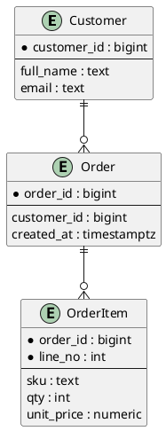
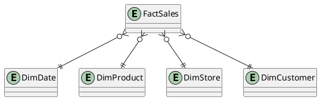
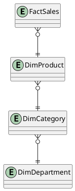

# Проектирование модели данных

Проектирование модели данных определяет, как бизнес-сущности, связи и ограничения будут реализованы в хранилище. Качественная модель снижает стоимость изменений, упрощает интеграции и помогает контролировать производительность.

## Цель

- перевести бизнес-процессы в устойчивую структуру данных;
- обеспечить корректность, расширяемость и производительность;
- сформировать основу для аналитики и масштабирования.

## Этапы проектирования

1. Концептуальная модель: сущности и связи без технических деталей.
1. Логическая модель: атрибуты, ключи, ограничения, типы связей.
1. Физическая модель: типы данных, индексы, партиционирование, storage engine.
1. Проверка на реальных запросах: read/write профили, планы запросов, SLA.

## ER-моделирование



## Схемы для аналитики: Star и Snowflake

### Star schema



Сильная сторона: простые и быстрые аналитические запросы.

### Snowflake schema



Сильная сторона: меньше дублирования в измерениях, но более сложные JOIN.

## Нормализация vs денормализация

- OLTP-контур: чаще нормализованная модель (до 3NF/BCNF).
- OLAP-контур: чаще денормализованные витрины (star/snowflake).

Подробно: [Нормализация и денормализация](normalization/index.md)

## Выбор индексов

### Базовые стратегии

- B-tree: равенство, диапазон, сортировка.
- Hash: точечное равенство в некоторых СУБД.
- GIN/GiST: JSONB, полнотекст, массивы, геоданные (PostgreSQL).
- Composite index: под частые фильтры и сортировки.

### Пример

```sql
CREATE INDEX idx_orders_customer_created
ON orders (customer_id, created_at DESC);

SELECT *
FROM orders
WHERE customer_id = 932
ORDER BY created_at DESC
LIMIT 50;
```

## Оптимизация запросов

1. Проверять план выполнения (`EXPLAIN` / `EXPLAIN ANALYZE`).
1. Убирать лишние full scan на больших таблицах.
1. Минимизировать `SELECT *` в горячих путях.
1. Проверять порядок колонок в составных индексах.
1. Переписывать N+1 паттерны в batch-запросы.
1. Вынести тяжелые отчеты в DWH/витрины.

## Частые ошибки

- моделировать таблицы напрямую из UI-экранов;
- выбирать индексы без анализа реальных запросов;
- смешивать OLTP и OLAP в одной схеме без разделения нагрузок;
- игнорировать версионирование схемы и миграции.

## Практический чек-лист

- у сущностей есть устойчивые ключи;
- связи и кардинальности формализованы;
- требования к консистентности определены;
- top-N запросы покрыты индексами;
- модель проверена на прогнозируемом объеме данных.

## Смежные материалы

- [Нормализация и денормализация](normalization/index.md)
- [Индексы](sql/indexes.md)
- [Масштабирование БД](scaling/index.md)
- [DWH и Data Lake](dwh-and-data-lake.md)
