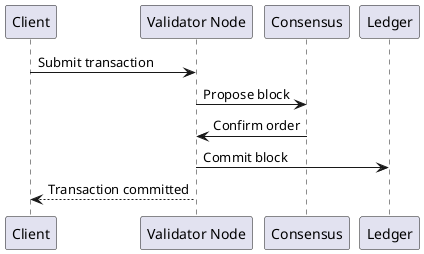

# Распределенные реестры

Распределенный реестр (DLT) хранит записи на нескольких независимых узлах и использует консенсус для подтверждения изменений. Ключевые свойства: неизменяемость истории, аудитируемость и отсутствие единственного доверенного центра.

## Когда выбирать

- несколько организаций должны совместно вести данные без общего владельца;
- критичны неизменяемость и доказуемость истории операций;
- важны встроенные механизмы доверия и верификации.

## Классы систем

- Public blockchain: открытые сети (Bitcoin, Ethereum).
- Permissioned ledger: доступ по ролям (Hyperledger Fabric, Corda, Quorum).

## Пример записи транзакции

```json
{
  "tx_id": "0x7f3a...",
  "from": "orgA",
  "to": "orgB",
  "asset_id": "shipment-2026-0042",
  "operation": "transfer_ownership",
  "timestamp": "2026-02-09T10:21:00Z",
  "block_height": 248019
}
```

## Примеры платформ

- Ethereum
- Hyperledger Fabric
- R3 Corda
- Quorum

## Типовой поток транзакции



## Достоинства

- неизменяемый audit trail;
- прозрачная история изменений;
- снижение зависимости от посредника;
- криптографическая верификация записей.

## Недостатки

- производительность ниже классических OLTP БД;
- сложность интеграции с корпоративным контуром;
- стоимость операций и governance-процессов;
- юридические и регуляторные ограничения по домену.

## Области применения

- межбанковские/межорганизационные расчеты;
- цепочки поставок и происхождение товара;
- цифровая идентичность;
- нотариализация и подтверждение неизменности документов.

## Практические рекомендации

- сначала формализовать trust model и governance;
- выбирать permissioned вариант для enterprise-кейсов;
- хранить большие payload во внешнем хранилище, в ledger только hash/ссылки;
- заранее проектировать off-chain интеграции.

## Переход к подразделам

- [Blockchain и смарт-контракты](blockchain-and-smart-contracts.md)
