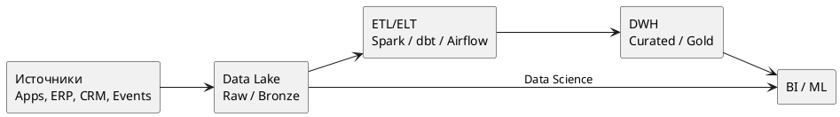

# DWH и Data Lake

DWH и Data Lake решают разные задачи аналитического контура. В зрелой архитектуре они часто используются вместе.

## DWH (Data Warehouse)

DWH это структурированное хранилище для аналитики и отчетности с управляемой моделью данных (star/snowflake), SLA качества и предсказуемыми BI-запросами.

Примеры платформ:

- Snowflake
- BigQuery
- Amazon Redshift
- ClickHouse (часто как аналитический слой)

Типовой запрос:

```sql
SELECT d.month, p.category, SUM(f.revenue) AS revenue
FROM fact_sales f
JOIN dim_date d ON d.date_id = f.date_id
JOIN dim_product p ON p.product_id = f.product_id
GROUP BY d.month, p.category
ORDER BY d.month, revenue DESC;
```

## Data Lake

Data Lake это хранилище сырых и полуструктурированных данных в исходном формате (JSON, Parquet, Avro, CSV, logs, events).

Примеры платформ:

- Amazon S3 + Glue/Athena
- Azure Data Lake Storage
- Google Cloud Storage + BigLake
- HDFS/Spark Lakehouse stack

Типовой сценарий:

- ingest сырых событий из приложений и брокеров;
- batch/stream обработка;
- публикация curated-слоев в DWH/витрины.

## Lakehouse-подход

Современный подход объединяет гибкость lake и управляемость warehouse.

Технологии:

- Delta Lake
- Apache Iceberg
- Apache Hudi

## Архитектурная схема



## DWH vs Data Lake

| Критерий | DWH | Data Lake |
| --- | --- | --- |
| Тип данных | структурированные | сырые и полуструктурированные |
| Schema | schema-on-write | schema-on-read |
| Пользователи | BI, аналитики, финансы | data engineers, data scientists |
| SLA отчетности | высокий | зависит от конвейера |

## Практические рекомендации

- использовать Data Lake как landing zone и исторический слой;
- строить DWH как trusted analytical layer для бизнеса;
- внедрять Data Catalog и lineage для прозрачности;
- формализовать data contracts между источниками и аналитикой.

## Смежные материалы

- [Проектирование модели данных](data-modeling.md)
- [Master Data Management (MDM)](mdm.md)
- [Data Governance](data-governance.md)
