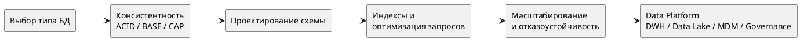

# Базы данных

Раздел собран как практическое руководство по выбору и проектированию баз данных: от модели хранения и консистентности до схемы, индексов, масштабирования и управления данными на уровне предприятия.

## Что покрывает раздел

- выбор типа БД под профиль нагрузки и бизнес-ограничения;
- модели консистентности и распределения данных;
- проектирование схем: ER, нормализация, star/snowflake;
- индексация и оптимизация запросов;
- масштабирование: партицирование, шардирование, репликация;
- платформенные темы: DWH, Data Lake, MDM, Data Governance.

## Карта раздела

## Быстрый алгоритм выбора

1. Определите критичность транзакционной консистентности.
1. Оцените профиль нагрузки: OLTP, OLAP, mixed.
1. Оцените структуру данных: жесткая схема или часто меняющаяся.
1. Зафиксируйте требования по задержке, масштабу и доступности.
1. Выберите тип БД и проверьте архитектуру на CAP-компромиссы.
1. Спроектируйте схему, индексы и стратегию масштабирования.

## Переход к подразделам

- [Типы баз данных](types/index.md)
- [Консистентность и распределение](consistency-and-distribution.md)
- [Распределенные реестры](distributed-ledgers/index.md)
- [Проектирование модели данных](data-modeling.md)
- [Нормализация и денормализация](normalization/index.md)
- [SQL](sql/index.md)
- [Масштабирование БД](scaling/index.md)
- [Реплицирование данных](replication.md)
- [DWH и Data Lake](dwh-and-data-lake.md)
- [Master Data Management (MDM)](mdm.md)
- [Data Governance](data-governance.md)
- [Бэкапирование данных](backup.md)
