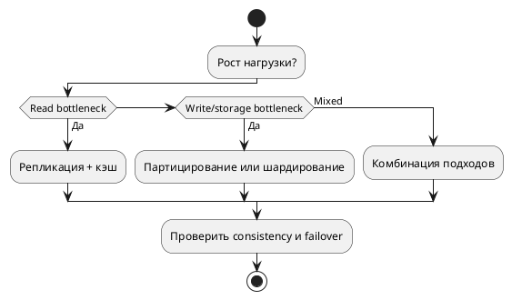

# Масштабирование БД

Масштабирование БД это набор архитектурных решений для роста нагрузки без потери SLA по задержке, доступности и стоимости.

## Основные стратегии

- вертикальное масштабирование: усиление одного узла;
- партицирование: деление большой таблицы внутри одного контура;
- шардирование: распределение данных между узлами;
- репликация: масштаб чтения и отказоустойчивость;
- кэширование и read-model для разгрузки primary storage.

## Схема принятия решений

## Партицирование vs шардирование

| Критерий | Партицирование | Шардирование |
| --- | --- | --- |
| Где делим данные | внутри одного кластера/таблицы | между разными узлами/кластерами |
| Цель | ускорить запросы и обслуживание больших таблиц | масштабировать write/read и storage горизонтально |
| Сложность | средняя | высокая |
| Типичный риск | неверный partition key | hot shard и сложный cross-shard query |

## Практический подход

1. Сначала исправить модель и индексы.
1. Отделить OLTP и OLAP нагрузки.
1. Затем выбирать partition/shard ключи на основании реальных запросов.
1. Проверять failover и процесс восстановления до production.

## Антипаттерны

- шардирование без явного bottleneck;
- отсутствие стратегии rebalancing;
- cross-shard транзакции без компенсационных механизмов;
- репликация без мониторинга lag.

## Смежные материалы

- [Партицирование](partitioning.md)
- [Шардирование](sharding.md)
- [Реплицирование данных](../replication.md)
- [Консистентность и распределение](../consistency-and-distribution.md)
