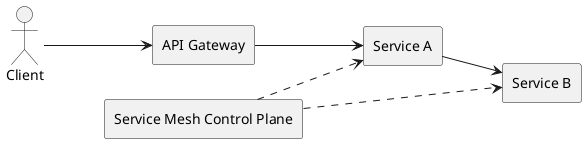

# API Gateway и Service Mesh

API Gateway и Service Mesh решают разные уровни задач: north-south и east-west трафик.

## API Gateway

Функции:

- единая точка входа;
- auth, rate limit, request validation;
- routing, transformation, API composition;
- observability и API analytics.

Примеры: Kong, NGINX, Apigee, AWS API Gateway.

## Service Mesh

Функции:

- mTLS между сервисами;
- retry/timeout/circuit breaker на межсервисных вызовах;
- traffic shifting (canary, blue/green);
- distributed tracing без изменения кода.

Примеры: Istio, Linkerd, Consul Mesh.

## Схема

## Когда что использовать

- внешний B2C/B2B API: обязательно gateway;
- микросервисы с большим east-west трафиком: mesh;
- зрелая платформа: gateway + mesh совместно.

## Типичные ошибки

- попытка использовать gateway вместо mesh для east-west;
- дублирование политик в каждом сервисе;
- отсутствие единых trace-id/correlation-id сквозь gateway и mesh.

## Смежные материалы

- [Безопасность API (OAuth 2.0, JWT, mTLS)](security.md)
- [Паттерны надежности](../integration-methods/reliability-patterns.md)
