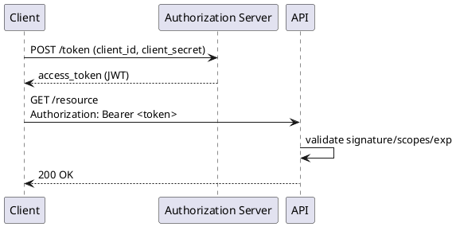

# Безопасность API (OAuth 2.0, JWT, mTLS)

Безопасность интеграций проектируется на уровне identity, transport и runtime-политик.

## Базовые слои

- Authentication: кто вызывает API.
- Authorization: что вызывающему разрешено.
- Transport security: защищенный канал.
- Threat protection: защита от replay, brute-force, abuse.

## OAuth 2.0

Основной стандарт delegated authorization.

Наиболее используемые grant types:

- Authorization Code + PKCE (пользовательские клиенты);
- Client Credentials (service-to-service).

## JWT

JWT часто используется как access token.

Что проверять на gateway/service:

- подпись (`alg`, `kid`);
- `iss`, `aud`, `exp`, `nbf`;
- scopes/roles;
- clock skew.

## mTLS

mTLS обеспечивает mutual authentication по сертификатам между сервисами.

Когда критично:

- межсервисный трафик в zero-trust контурах;
- B2B-интеграции;
- финансовые/регуляторные домены.

## Поток OAuth2 (client credentials)

## Практические контрмеры

- short-lived access tokens + refresh policy;
- key rotation и JWKS;
- strict TLS policy (TLS1.2+);
- защита от replay (nonce, idempotency key);
- WAF + rate limiting + anomaly detection.

## Типичные ошибки

- хранение долгоживущих токенов без ротации;
- отсутствие проверки `aud`;
- доверие к JWT без проверки подписи;
- mTLS только на perimeter, но не внутри service mesh.

## Смежные материалы

- [Лимиты и квоты](rate-limiting.md)
- [Идемпотентность](idempotency.md)
- [API Gateway и Service Mesh](api-gateway-and-service-mesh.md)
