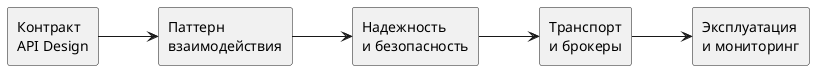

# Интеграции

Раздел описывает интеграции как инженерную систему: выбор контрактов, паттернов взаимодействия, надежности, безопасности и эксплуатационных практик.

## Что покрывает раздел

- дизайн API: REST, GraphQL, gRPC, JSON-RPC, SOAP;
- описание контрактов (OpenAPI, AsyncAPI, RAML), версионирование и совместимость;
- безопасность: OAuth 2.0, JWT, mTLS, rate limiting, idempotency;
- архитектурные элементы: API Gateway, Service Mesh;
- паттерны интеграции: request/response, pub/sub, Saga, CQRS, event-driven;
- паттерны надежности: retry, timeout, circuit breaker, bulkhead, DLQ;
- брокеры сообщений, file exchange, shared database;
- наблюдаемость: trace-id, correlation-id, SLI/SLO.

## Карта решений

## Выбор API-стиля

| Стиль | Когда применять | Сильные стороны | Ограничения |
| --- | --- | --- | --- |
| REST/HTTP | Публичные и партнерские API | Простота, экосистема, кеширование | Не всегда удобен для сложных графов данных |
| GraphQL | Клиентам нужен гибкий набор полей | Точное получение данных, меньше overfetch | Сложность контроля cost/лимитов |
| gRPC | Внутренние высоконагруженные сервисы | Производительность, строгие контракты | Ниже удобство для внешних web-клиентов |
| JSON-RPC | Командно-ориентированные API | Простота вызовов процедур | Меньше стандартных REST-практик |
| SOAP | Enterprise/регуляторные контуры | Стандарты WS-* и формальные контракты | Высокая сложность и verbosity |

## Паттерны взаимодействия

| Паттерн | Когда использовать | Риски |
| --- | --- | --- |
| Request/Response | Нужен мгновенный ответ | Чувствительность к задержкам и каскадным сбоям |
| Publish/Subscribe | Слабая связанность и масштаб событий | Сложнее отладка и гарантии порядка |
| Saga | Распределенные бизнес-транзакции | Сложность компенсаций и наблюдаемости |
| CQRS | Разные профили read/write | Архитектурная сложность и eventual consistency |
| Event-driven | Высокая асинхронность и расширяемость | Требует строгой схемы событий и дисциплины версий |

## Надежность и безопасность

Минимальный стандарт:

- идемпотентность для повторяемых операций записи;
- retry c backoff и jitter, timeout и circuit breaker;
- bulkhead для изоляции деградации;
- mTLS для межсервисных вызовов в доверенном контуре;
- OAuth 2.0/JWT для внешнего доступа;
- лимиты и квоты на gateway-слое.

## Быстрый алгоритм выбора интеграционного подхода

1. Зафиксировать профиль взаимодействия: sync/async/batch/stream.
1. Выбрать паттерн и транспорт (HTTP/gRPC/broker/file).
1. Определить контракт и стратегию версионирования.
1. Добавить безопасность и idempotency.
1. Спроектировать надежность (retry/breaker/DLQ).
1. Настроить observability и правила SLO.

## Кейсы по доменам

### Финтех

- REST/gRPC + строгая идемпотентность;
- обязательные audit logs и mTLS;
- паттерн Saga для распределенных платежных сценариев.

### E-commerce

- API Gateway для фронт-клиентов;
- Kafka/RabbitMQ для событий заказа и уведомлений;
- акцент на деградационные стратегии и rate limiting.

### Госуслуги

- формальные контракты и повышенные требования совместимости;
- строгая версионизация и трассировка изменений;
- контроль SLA обмена с внешними реестрами.

## Первоисточники и стандарты

- OpenAPI Specification: <https://spec.openapis.org/oas/latest.html>
- AsyncAPI Specification: <https://www.asyncapi.com/docs/reference/specification/latest>
- GraphQL Specification: <https://spec.graphql.org/>
- gRPC docs: <https://grpc.io/docs/>
- OAuth 2.0 (RFC 6749): <https://www.rfc-editor.org/rfc/rfc6749>
- JWT (RFC 7519): <https://www.rfc-editor.org/rfc/rfc7519>
- HTTP Semantics (RFC 9110): <https://www.rfc-editor.org/rfc/rfc9110>

## Переход к подразделам

- [Проектирование API](api-design/index.md)
- [Способы интеграции](integration-methods/index.md)
- [Сетевое взаимодействие](networking/index.md)

## Контрольные вопросы

- Почему выбранный стиль API лучше других для текущего сценария?
- Где в потоке обеспечивается идемпотентность и обратная совместимость?
- Какие паттерны надежности защищают от каскадного отказа?
- Как связаны SLO интеграции и бизнес-SLA процесса?
- Какие метрики и дашборды нужны для оперативного контроля интеграций?
