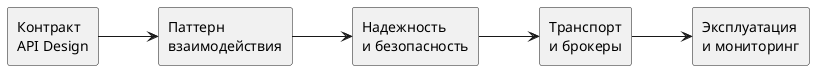

# Интеграции

Раздел описывает интеграции как инженерную систему: выбор протокола, контрактов, паттернов взаимодействия, механизмов надежности и безопасности.

## Что покрывает раздел

- проектирование API (REST, GraphQL, gRPC, JSON-RPC, SOAP);
- описание контрактов (OpenAPI, RAML), версионирование, обратная совместимость;
- безопасность интеграций (OAuth 2.0, JWT, mTLS), rate limits, idempotency;
- API Gateway и Service Mesh;
- интеграционные паттерны (request/response, pub/sub, Saga, CQRS, EDA);
- паттерны надежности (retry, timeout, circuit breaker, bulkhead);
- брокеры сообщений, обмен файлами, shared DB;
- сетевые основы для интеграций.

## Карта решений

## Быстрый алгоритм выбора подхода

1. Определить профиль нагрузки: sync, async, realtime, batch.
1. Выбрать паттерн взаимодействия (request/response, pub/sub, event-driven).
1. Зафиксировать контракт и стратегию версионирования.
1. Определить требования по безопасности и лимитам.
1. Выбрать механизм надежности (retry/backoff, breaker, DLQ).
1. Подготовить observability: trace-id, correlation-id, SLI/SLO.

## Переход к подразделам

- [Проектирование API](api-design/index.md)
- [Способы интеграции](integration-methods/index.md)
- [Сетевое взаимодействие](networking/index.md)
