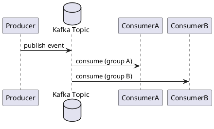

# Kafka

Kafka это распределенный commit log для событийных потоков с высокой пропускной способностью.

## Базовые сущности

- topic;
- partition;
- producer;
- consumer group;
- offset;
- broker.

## Поток обработки

## Когда выбирать Kafka

- high-throughput event streaming;
- event sourcing;
- аналитические/ETL потоки;
- интеграция множества независимых потребителей.

## Ключевые решения

- partition key для порядка и распределения;
- retention policy;
- offset commit strategy;
- schema governance (Avro/Protobuf + registry).

## Типичные ошибки

- плохой partition key -> hot partition;
- отсутствие DLQ/retry topic;
- schema changes без compatibility checks;
- большие сообщения вместо ссылки на объект в storage.

## Практические рекомендации

- внедрять schema registry и compatibility policy;
- использовать idempotent producer и transactional semantics там, где нужно;
- наблюдать consumer lag и rebalance events;
- выделять отдельные топики под retry/DLQ.

## Смежные материалы

- [Интеграционные паттерны](../patterns.md)
- [Паттерны надежности](../reliability-patterns.md)
