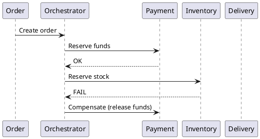

# Интеграционные паттерны

Паттерн интеграции определяет, как системы координируют состояние и обмениваются событиями.

## Request/Response

Синхронный вызов с быстрым ответом.

Когда применять:

- интерактивные операции;
- запросы с коротким SLA;
- когда результат нужен немедленно.

Риск: сильная связность и cascading failure.

## Publish/Subscribe

Издатель отправляет событие в канал, подписчики получают независимо.

Когда применять:

- fan-out уведомления;
- реактивные процессы;
- интеграция нескольких потребителей без tight coupling.

## Saga

Координация распределенной бизнес-транзакции через цепочку локальных транзакций и компенсаций.

### Оркестрация SAGA

## CQRS

Разделение модели записи (Command) и чтения (Query).

Когда применять:

- разные профили write/read;
- сложные read-модели и витрины;
- event-driven архитектура.

## Event-Driven Architecture (EDA)

Система реагирует на события, а не на прямые синхронные вызовы.

Плюсы:

- масштабируемость;
- слабая связность;
- удобная эволюция потребителей.

Риски:

- eventual consistency;
- сложность отладки и трассировки;
- необходимость event contract governance.

## Практические рекомендации

- фиксировать ownership каждого события;
- versioning event payload делать явно;
- вводить correlation id сквозь весь поток;
- закладывать idempotent consumers по умолчанию.

## Смежные материалы

- [Паттерны надежности](reliability-patterns.md)
- [Брокеры сообщений](message-brokers/index.md)
