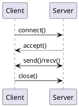

# Сокеты

Сокет это программная точка доступа к сети для обмена данными между процессами по TCP или UDP.

## Модель

- server socket: слушает порт и принимает соединения;
- client socket: устанавливает соединение с сервером;
- двусторонний обмен данными по протоколу приложения.

## Базовый поток TCP-сокетов

## Что важно в production

- connection pooling;
- таймауты и keepalive;
- максимальное число соединений и файловых дескрипторов;
- backpressure и очереди;
- TLS termination и сертификаты.

## Типичные ошибки

- отсутствие read/write timeout;
- блокирующие вызовы без ограничений;
- игнорирование partial reads/writes;
- утечки соединений.

## Практические рекомендации

- проектировать протокол сообщений (framing, headers, correlation-id);
- использовать неблокирующий IO там, где нужна высокая конкуррентность;
- измерять connection errors, reset rate и saturation по fd.

## Смежные материалы

- [TCP/IP](tcp-ip.md)
- [WebSockets](../integration-methods/api/websockets.md)
